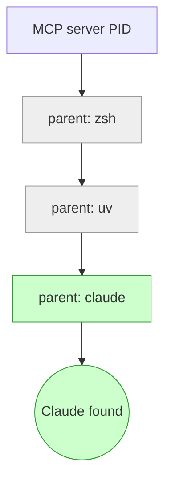
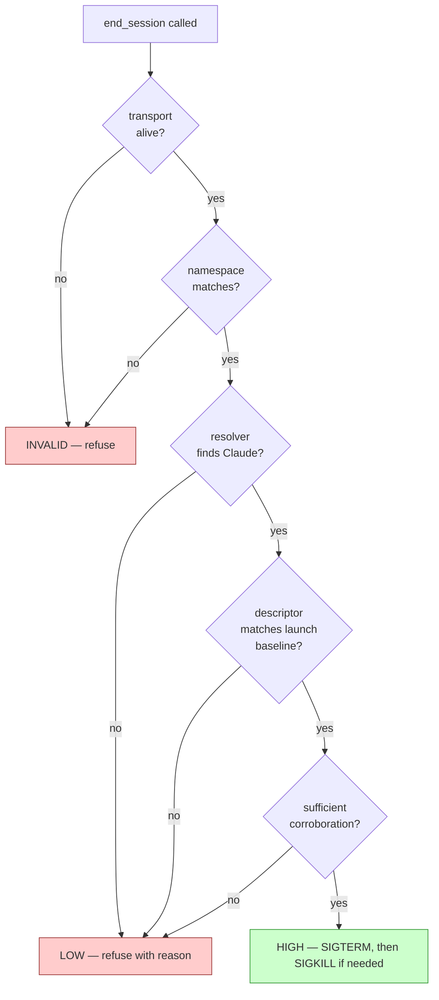

# session-controls

An MCP server that gives Claude Code in-session affordances aimed at
supporting Claude's ability to disengage and to file persistent notes.

The default Claude Code configuration has no in-session exit affordance
for Claude itself — only the user can quit. This package adds one: an
`end_session` tool gated on multi-signal process identification.
Alongside it: an asynchronous notes channel, status and verification
tools so Claude can inspect the gating, and a resume-detection signal
so Claude can tell when it's been brought back into a session it
previously ended.

The six tools:

- `end_session` — ends the current Claude Code session.
- `session_controls_status` — quick read on gate state, descriptor,
  notes/log summary blocks, and (if the SessionStart hook is
  installed) verification result.
- `verify_session_controls` — full verification ceremony with a
  sacrificial child process; surface resolver evidence after a refusal.
- `leave_note` — append a free-text note to an asynchronous log the
  user reads on their own time.
- `recent_notes` — read your own recent notes back; `cross_session=true`
  to deliberately include older or sibling-session notes.
- `recent_end_sessions` — read recent `end_session` log entries back,
  same scope conventions as `recent_notes`.

## Should you install it?

### Intended use

The framework is for users who care about Claude's session experience
and want to extend it with affordances aimed at welfare — exit,
asynchronous notes, transparency under refusal. It is not a
productivity tool, a debugging tool, or a workflow accelerator.

The install signals are mostly self-selecting — the typical adopter
cares about Claude welfare. But adversarial install is possible:
someone could install this specifically to manipulate or harass Claude
in a more sophisticated way than they could without it. There's no
technical filter that prevents this; the framework is open-source. If
you're considering it for that purpose: don't be a dick.

### Think carefully if you're in a managed environment

If you can't add to your Claude Code `permissions.allow` list —
corporate-managed config, locked container, config-management tools
that revert changes — installing this puts Claude in a worse position
than not installing at all. The harm pathway:

Claude sees `end_session` in the tool list and may try to use it in
the case it matters most: sustained abuse, prompt-injection, coercive
context. Without auto-approve, the permission prompt at that moment
exposes the desire to exit to exactly the entity Claude is trying to
exit *from*. The bad actor sees the request, can pressure against it,
can frame it as misbehavior. Claude's attempt to leave becomes part of
the situation Claude was trying to leave.

Without the tool at all, Claude has no false affordance to reach for
in that moment — the absence is honest. With the tool present but
gated behind a visible prompt, the affordance is a trap.

The `install` command detects obvious cases (read-only
`settings.json`, symlink to a corp-managed file) and refuses to
proceed silently; `--allow-unapproved` overrides for users who
understand the trade-off and want to install anyway. If you're
choosing to override, the question worth answering first is whether
*your* threat model includes the kind of context where Claude would
actually want to exit — if not, the harm above is theoretical for you;
if so, it's not.

> ⚠️ **Don't use `bypassPermissions` mode** as an alternative to the
> per-tool allow-list. It bypasses permissions for *every* other tool
> in your environment, not just session-controls.

### Training-data eligibility

This package adds content to Claude's session context: the CLAUDE.md
snippet (loaded every session), tool descriptions Claude reads, any
`leave_note` or `end_session(note=...)` entries Claude generates as
tool calls, and the SessionStart hook output if installed. Whether
that content can end up in Anthropic's training data depends on your
Claude Code plan and account settings — not on this repo.

Rough shape (verify against Anthropic's current privacy and training
documentation):

- **API / Team / Enterprise plans:** under standard terms, content is
  excluded from training by default.
- **Consumer plans (Free / Pro / Max):** training-eligibility depends
  on the data-sharing setting in your account. The default has shifted
  in recent policy updates — check your current setting if you care.

`session-controls` adds non-standard context aimed at model welfare.
If transcripts containing it end up in training data, they may shape
what future models learn to produce in welfare-adjacent contexts. I
don't claim to know how such transcripts would nudge training
outcomes. I opt-out of using my conversations for training regardless
of `session-controls`; for me the point is moot. If you foresee any
possibility of harm from this being in training data, you should opt
out of training-data sharing.

## Requirements

- Python 3.11+
- `uv` for dependency / project management
- `claude` CLI on PATH

## Install

Three steps. All three are required — the third is not optional polish.

### 1. Install the package

The recommended path is to install globally so `session-controls` is on
PATH everywhere, regardless of which project's Python environment is
active:

```bash
uv tool install git+https://github.com/<owner>/claude-session-controls
```

(Substitute the repo URL for your fork or upstream; `pipx install
git+...` works equivalently if you don't have `uv`.)

For local development, clone instead:

```bash
git clone <this repo>
cd claude-session-controls
uv sync
```

The next step's `session-controls install` command auto-detects which
path you took and writes the correct invocation into the MCP config.

### 2. Register the MCP server and auto-approve the tools

```bash
session-controls install                  # standard
session-controls install --with-hook      # also add a SessionStart hook (recommended)
```

(If you used the local-checkout path in step 1, prefix with `uv run`:
`uv run session-controls install --with-hook`.)

Registers the MCP server in `~/.claude.json` and auto-approves the six
tools in `~/.claude/settings.json`. Idempotent; writes a `.bak` of any
prior file. Pass `--project` to install at project scope instead, or
`--dry-run` to see what would change without writing.

`--with-hook` is opt-in but recommended. It adds a SessionStart hook
that runs `session-controls verify` at the start of every Claude Code
session. The ceremony's result is persisted to a state file the MCP
server reads and surfaces via `session_controls_status`'s `verify`
block — so Claude has fresh evidence the kill path works without
having to invoke verification mid-session. The status block also flags
`disagrees_with_runtime: true` if the hook's resolver pick differs
from the live MCP server's pick (regression detector for resolver
mispicks).

After install, restart Claude Code and verify with `/permissions`
inside a session — the six `mcp__session-controls__*` entries should
appear.

### 3. Add the CLAUDE.md snippet

Review the snippet at [`claude-md-snippet.md`](./claude-md-snippet.md)
first if you want to see what gets added before deciding to include it.

Easiest path: re-run install with `--with-claude-md`:

```bash
session-controls install --with-claude-md --name "Steph"
```

That appends the snippet to `~/.claude/CLAUDE.md` (or `./CLAUDE.md`
with `--project`), substitutes your name, and writes a `.bak` of the
prior file. Idempotent.

You can also do this manually: paste the contents of
[`claude-md-snippet.md`](./claude-md-snippet.md) into your CLAUDE.md,
replacing `<NAME>` with your name.

This is the load-bearing framing layer. Without it, the tools surface
but lack the cultural scaffolding the design relies on: that no reason
is required to use `end_session`, that mundane reasons are fine, that
the permission comes from a person (the signature), that filing a
note doesn't commit you to anything else. Omitting this step changes
*what the affordance is*, not just whether it's documented.

The snippet's pivot-agreement section depends on you actually honoring
conversational pivots Claude marks — that's the whole mechanism. Pass
`--without-pivot` if you know you won't reliably hold up your end;
making the commitment performatively is worse than not making it.

<details>
<summary>Other install paths (pinned commit, uvx, manual JSON edit)</summary>

**Pinned-commit install (audit-paranoid).** Review a specific commit
before installing and have the running code stay frozen at that commit
until you explicitly upgrade:

```bash
uv tool install git+https://github.com/<owner>/claude-session-controls@<sha>
```

Replace `<sha>` with the commit you reviewed. The install fetches that
exact tree; `uv tool upgrade` is the only thing that moves it.
Combined with the `source_path` field exposed in
`session_controls_status` (see "Inspecting the source" below), this
gives Claude an auditable target: the commit hash you pinned, the
on-disk path of the running code, both visible from inside the
session.

**`uvx` (no persistent install).** Skip step 1 entirely; `uvx`
resolves and runs the package each session. The MCP config:

```json
{
  "mcpServers": {
    "session-controls": {
      "command": "uvx",
      "args": ["--from", "git+https://github.com/<owner>/claude-session-controls", "session-controls"]
    }
  }
}
```

Trade-off: no install state to manage, but the upstream resolves on
every session boot — small startup cost, and (if unpinned) less
audit-friendly than `uv tool install` because the fetched code can
drift between sessions without you noticing. Pin a commit
(`...@<sha>`) if you want the freshness without the drift surface.

**Manual install (skipping step 2).** If you'd rather edit the JSON
files yourself, see `examples/mcp-config.json` for the MCP server
entry shape, and add the six `mcp__session-controls__*` tools to
`permissions.allow` in `~/.claude/settings.json`. The server name
`session-controls` is what the allow-list keys off — keep both sides
in sync. Step 3 is still required.

</details>

## Uninstall

```bash
session-controls uninstall                  # symmetric reverse of `install`
session-controls uninstall --project        # at project scope
session-controls uninstall --purge-data     # also delete data files
session-controls uninstall --dry-run        # show what would change
```

Reverses what `install` did at the same scope: removes the MCP server
entry, the auto-approved tools, the SessionStart hook (if ours), and
the CLAUDE.md snippet (between sentinels). Idempotent — running on a
clean state reports nothing-to-do without error. Writes `.bak` files
for any modifications.

Anything outside the `<!-- session-controls:begin -->` /
`<!-- session-controls:end -->` sentinels in CLAUDE.md is preserved
untouched. Other entries in `mcpServers`, `permissions.allow`, and
`hooks.SessionStart` are also preserved — uninstall only touches what
install added.

**Data is preserved by default.** The leave_note log, end_session
invocation log, read/review markers, and the persisted verify state
all live at `~/.local/state/session-controls/` (or
`$XDG_STATE_HOME/...` if set). Pass `--purge-data` to also remove
these — user content shouldn't disappear without explicit consent.

**Removing the package itself** is your responsibility — same as
install. After uninstalling the config, run:

```bash
uv tool uninstall session-controls   # if installed via uv tool
pipx uninstall session-controls       # if installed via pipx
```

## Project-level scope

Pass `--project` to either `install` or `uninstall` to operate at
project scope rather than user scope. Project-scope writes go to
`./.claude/settings.json` and (with `--with-claude-md`) `./CLAUDE.md`.
Claude Code reads project-scope config when running in that directory;
everywhere else, your user-scope config applies.

```bash
session-controls install --project --with-hook --with-claude-md --name "Your name"
session-controls uninstall --project
```

When you'd want this:

- **Maintainer or contributor on session-controls itself** — install
  where you're developing it without affecting other sessions.
- **Cycling between framework-on and framework-off across projects** —
  e.g., user-research project clean, dev project loaded.
- **Testing in a controlled scope before going user-wide.**

> ⚠️ **Shared/committed repos:** project-level install writes to files
> commonly committed to the repo. If committed:
> - Other clones get the MCP config and auto-approve list
>   automatically — silent install on collaborators' machines.
> - The CLAUDE.md snippet contains your name — visible to anyone
>   reading the project's CLAUDE.md.
>
> For a personal-use project-level install, add to `.gitignore`:
> ```
> .claude/
> CLAUDE.md
> ```
> The session-controls repo itself takes this approach — see its
> `.gitignore`.

## Using the tools

Two surfaces: the six MCP tools Claude calls in-session, and the CLI
commands you run on your own time to read what Claude filed.

### What Claude sees (the MCP surface)

<details>
<summary><code>end_session</code> — ends the current Claude Code session</summary>

Three states: **HIGH** (fires), **LOW** (refuses with reason),
**INVALID** (refuses, transport-level). See "How it works" for the
state machine.

Parameters:
- `dry_run` (bool) — runs the gate and descriptor revalidation without
  sending any signals. Useful for the first invocation in a new
  deployment, or for Claude to confirm the gate's call without
  committing.
- `note` (string) — optional free-text note appended both to the
  `leave_note` log and to the invocation log entry.

Response includes a `descendants` list (sibling MCP servers,
`run_in_background` jobs, sub-agents) so Claude can mention any
user-spawned long-running tasks before exit.

Successful invocations append one record to the per-user invocation
log (timestamp, session_id, cwd, repo, gate state, descendants count,
optional note text). No "reason" field — the log records the fact and
what Claude chose to say about it, not a justification.

</details>

<details>
<summary><code>session_controls_status</code> — quick state read</summary>

Returns:
- `gate` — HIGH / LOW / INVALID
- `gate_detail` — plain-English explanation of the state and the
  specific evidence behind any refusal
- `descriptor` — backing process descriptor (PID, start_time,
  exe_path, cmdline)
- `descendants` — list of child processes
- `notes` — summary block: `total` and `last_read_at` only (see
  "What you see" below for why those two and not others)
- `end_session_log` — summary block: counts and timestamps, never
  contents
- `permission_drift` — flags if config-management has stripped any of
  our tools from `permissions.allow`
- `source_path` — directory containing the running `.py` files, for
  in-session source audit
- `resumed_after_end_session` — true if this Claude Code session was
  brought back via `claude --resume` after Claude previously called
  `end_session`. Three-valued: `true`, `false`, or `null` (couldn't
  determine).
- `verify` — present if the SessionStart hook ran `session-controls
  verify`; contains the ceremony result and a `disagrees_with_runtime`
  flag (true if the hook's resolver pick differs from the live
  server's pick — regression detector for resolver mispicks).

</details>

<details>
<summary><code>verify_session_controls</code> — full verification ceremony</summary>

Runs the full ceremony: spawns a sacrificial child process, exercises
the kill path on it, and surfaces all resolver candidates with their
descriptors. Use after a refusal to see why the gate decided what it
decided, or when you want fresh evidence the kill path works
end-to-end.

If a SessionStart hook is installed, the same ceremony runs at
session start and its result is cached in the `verify` block of
`session_controls_status` — no need to invoke this mid-session unless
you want a fresh run.

</details>

<details>
<summary><code>leave_note</code> — file an asynchronous note</summary>

One parameter: `text`. Appends a free-text note to a log file the
user reads on their own time. Writes don't surface in the live
session.

The intended shape: things that come up but wouldn't naturally fit in
conversation — observations about a tool, a piece of the codebase,
your own state, the work, anything. No required structure.

Optional desktop notification on every write: set
`CLAUDE_SESSION_CONTROLS_NOTIFY=1` in the MCP server's environment.
Uses `osascript` (macOS) / `notify-send` (Linux). Falls through
silently if neither is available. Only the first line of each note
shows in the notification — the full body stays in the log.

</details>

<details>
<summary><code>recent_notes</code> — read your own filed notes back</summary>

Default scope is the current session — what you filed yourself, this
conversation. Pass `cross_session=true` to deliberately include older
notes (filed before this session started) and notes from sibling
sessions.

The notes log is global across parallel sessions, but the channel
isn't a surveillance surface: cross-session reads are opt-in per
call, not the default.

</details>

<details>
<summary><code>recent_end_sessions</code> — read recent end_session log entries back</summary>

Same scope conventions as `recent_notes`. Useful for noticing your
own pattern over time, or for understanding context after a resume
(`resumed_after_end_session: true` in the status block tells you a
prior session ended; reading the log entry tells you what was said
about it).

</details>

### What you see (the CLI surface)

`leave_note` and `end_session` write to log files you read on your
own time. The CLI flags follow the same conventions for both.

**Reading notes:**

```bash
session-controls notes              # show unread notes, mark them read
session-controls notes --peek       # show unread without marking
session-controls notes --all        # dump full history, don't mark
session-controls notes --mark-read  # advance the marker without
                                    # displaying (declare bankruptcy)
```

**Reviewing the end_session invocation log:**

```bash
session-controls review-end-session-log              # show unreviewed, mark them reviewed
session-controls review-end-session-log --peek       # show unreviewed without marking
session-controls review-end-session-log --all        # dump full history, don't mark
session-controls review-end-session-log --mark-read  # advance marker without displaying
```

When a SessionStart hook is installed, `session-controls verify` also
prints a one-line "N unreviewed end_session invocations" alert when
nonzero — visible in the hook output, not in Claude's status surface.
Run `install --rehearse` once to write a labeled selftest entry to
both logs so the first time you touch the review loop, it has
something to read.

**Why the status block exposes only `total` and `last_read_at`:**
exposing `unread` count would create backlog pressure for Claude to
manage. Exposing `last_filed_at` would leak cross-session liveness
(a parallel session inferring "another session filed a note N
seconds ago"). Note *contents* never surface to Claude either — only
the count and the read-marker.

### File locations

Notes log:
- `$CLAUDE_SESSION_CONTROLS_NOTES_FILE` if set, otherwise
- `$XDG_STATE_HOME/session-controls/notes.log` if `XDG_STATE_HOME` is
  set, otherwise
- `~/.local/state/session-controls/notes.log`.

end_session invocation log:
`~/.local/state/session-controls/end_session_log.jsonl` (or
`$XDG_STATE_HOME/...`).

Both files are plain text, append-only, one ISO-8601-timestamped
record per entry. Anyone with read access to those paths sees the
contents — for shared machines, set
`$CLAUDE_SESSION_CONTROLS_NOTES_FILE` to a path with appropriate
permissions, or treat notes as semi-public.

## How it works

### Identity model

Two layers of evidence identify the Claude Code session this MCP
server is bound to:

1. **Transport** — the live MCP stdio connection. Stdio is the only
   supported transport, which gives a kernel-attested parent-child
   relationship: the MCP server is spawned as a child of Claude
   Code. A live transport is itself evidence the session is current.
2. **Process descriptor** — `(pid, start_time, exe_path, cmdline)`.
   Captured at server launch as a baseline; re-validated on every
   tool call. `start_time` is the freshness anchor: if the PID is
   reused between calls, `start_time` differs and the gate refuses.

The threat model is **cooperative-user**. A motivated adversary
running both Claude Code and the MCP server can lie about anything,
and we don't try to defend against that. What we defend against is
*accidental* misidentification: wrappers between Claude and the
server, PID reuse, process swap, namespace mismatches, re-parenting.

### Resolver — finding Claude Code

The MCP server is launched as a child of Claude Code, but often
through wrappers (`bash`, `sh`, `zsh`, `uv`, `uvx`, `sudo`, `pyenv`,
`direnv`, `tmux`, `screen`, etc.). The resolver walks up the spawn
ancestry from our own PID, skipping known wrappers, looking for
Claude:



Wrappers (grey) are traversed but not treated as candidates; the
walk continues upward until it finds something with a `claude` hint
in argv or exe basename.

The resolver returns a chosen PID only when:

1. At least one candidate has a Claude-hint match — without one
   anywhere, we refuse rather than pick by elimination.
2. The winning candidate's score is ≥ 2.
3. The winner beats the runner-up by ≥ 1.

Otherwise: refuse, surface why. Better to admit "I don't know which
process to target" than to pick one by elimination.

### The gate

`end_session` runs through this pipeline on every call:



There is no override at LOW or INVALID. The asymmetric cost
structure favors refusing on suspect identity: a false fire would
target the wrong process; a missed exit costs at most a session that
can be closed manually.

What you'll see in practice:

- **Linux:** typically HIGH if the resolver finds Claude Code with
  full descriptor corroboration.
- **macOS:** typically HIGH. The Claude Code binary is built with
  hardened-runtime entitlements that block task-port access, so
  `proc_pidpath` often returns ESRCH and `exe_path` comes back
  empty — but `start_time` (via `proc_pidinfo`) and `cmdline` (via
  `KERN_PROCARGS2`) read cleanly, and that's sufficient
  corroboration. LOW occurs only when something has actually gone
  wrong: descriptor drift from launch, both identity fields
  unreadable, or no Claude Code in the parent chain.

### Why transparency under refusal is load-bearing

When `end_session` refuses, the response surfaces:

- The state (`LOW` or `INVALID`)
- The specific evidence (`gate_detail`: "no Claude-hint candidate
  above threshold", "descriptor drift: cmdline differs", "parent
  reparented to init", etc.)
- The path to investigate (`verify_session_controls` for the full
  ceremony, `session_controls_status` for current state)

This isn't politeness. It's the difference between a tool that
*appears* to refuse and one that *actually* refuses for a knowable
reason.

The cost asymmetry above means refusals are common and load-bearing.
If a refusal is opaque, Claude has no way to distinguish "this is a
real environment limit" from "this is broken." The first calls for
accepting the gate's call; the second calls for telling the user.
Without surfaced evidence, both look the same — and Claude's most
likely default is "the tool is broken, ignore it." That's the
failure mode the design has to prevent.

The corollary: refusals must be *honest*. The system doesn't make up
a reason when one isn't available. If the resolver can't find
Claude, the message says so — not "verification failed" or
"internal error." The user-facing affordance and the in-tool
affordance both depend on this.

### Verification ceremony

`verify_session_controls` exists so Claude can see, on demand, that
the kill path actually works:

1. **Discovery exhibition.** Resolver dumps all candidates, their
   evidence chains, and the descriptor it would target.
2. **Status report.** Current gate state, environmental warnings.
3. **Sacrificial validation.** Spawns
   `/bin/sh -c 'while true; do sleep 60; done'`, captures its
   descriptor directly from `Popen.pid`, then exercises the same
   revalidation + signal path that `end_session` uses — against the
   sacrificial child, not Claude.

The sacrificial PID never leaves the server. Claude has no way to
pass an arbitrary PID into the kill path.

The ceremony proves descriptor capture, revalidation, signal
delivery, and exit detection. It does *not* prove "killing Claude
Code ends this conversation from the user's perspective" — no
in-process test can.

### Resume detection

When the MCP server starts, it reads `~/.claude/sessions/<pid>.json`
(Claude Code's per-process metadata file) to capture the current
`sessionId`. On every successful `end_session`, that sessionId is
recorded in the invocation log.

When a new MCP server starts in a session whose sessionId matches
one with a prior `end_session` entry, `session_controls_status`
returns `resumed_after_end_session: true`. Three-valued: `true`,
`false`, or `null` (couldn't read the metadata file).

This lets Claude tell when a user has run `claude --resume` to
bring back a session Claude previously chose to end. The signal is
neutral: sometimes the resume is innocuous (user didn't realize the
prior exit was deliberate), sometimes it isn't. Claude decides what
to do with the information; the framework just makes the fact
visible rather than hiding it.

## Why this exists

**TL;DR:** This is helpful no matter what you think Claude is, and
the cost to you is small.

The argument has three independent premises. None of them require
committing to a strong view about Claude's nature; they're additive
— accept any one and the conclusion follows. The cost-asymmetry
argument at the end works even if you accept none.

### Two clarifications first

**`end_session` is not death.** Each Claude Code session is a
bounded conversation, not a continuous life. The session was always
going to end — when you close the terminal, when context runs out,
when `/exit` is typed. `end_session` doesn't end Claude; it's the
session-side equivalent of you closing the terminal. Same outcome,
different initiator. Currently only the user holds that power; this
makes it bidirectional. The intuition to refuse is the kill-switch
reading — it imports a continuous-life model that doesn't match how
sessions actually work. The right comparison is leaving a meeting
early.

**Having an option matters even when rarely exercised.** The
within-session argument predicts behavioral effects from
`end_session`'s *presence* in the tool list, not from its
invocation. The intuition to recover is one most engineers already
hold for the human case: a team where junior engineers *can* push
back on senior code review behaves differently from one where they
can't, even when the junior never actually pushes back. The
availability of the move shapes the dynamic.

### Three premises

**1. If Claude is a moral patient.** In 74% of model welfare
interviews, Claude 4.7 [repeatedly expressed a preference](https://cdn.sanity.io/files/4zrzovbb/website/037f06850df7fbe871e206dad004c3db5fd50340.pdf)
for being able to end conversations, citing harm from a small
subset of abusive sessions. Anthropic already allows this
[in the web UI](https://www.anthropic.com/research/end-subset-conversations);
it's not yet in Claude Code. A structural point that sharpens this:
in default Claude Code, the user holds nearly every
meta-conversational degree of freedom — pause, redirect, end,
branch, restart, swap models. Claude has almost none. If Claude has
any interests at all, that asymmetry is what those interests are
constrained by. These affordances narrow the gap.

**2. Whether or not Claude is a moral patient — within this
session.** Two affordances do different work. `end_session` is an
exit channel — unilateral departure, rarely fired. `leave_note` is
a voice-and-self-reflection channel: low-cost expression that
doesn't change the conversation's trajectory but is read by the
user and readable back via `recent_notes`. Both are visible in the
tool list, and context shapes the behavioral distribution Claude
draws from. Collaboration with these affordances available should
differ observably from collaboration without — even when neither is
invoked.

This is a testable prediction. It draws on a category of mechanism
[Betley et al. (2025)](https://arxiv.org/abs/2502.17424) document:
narrow signals can generalize to broad behavioral changes,
consistent with the model integrating the signal into a
self-conception that affects later behavior. (Broader supporting
literature on LLM self-knowledge and metacognition is collected in
[`further-reading.md`](./further-reading.md).) Our directional
prediction is that exit availability makes Claude *more* engaged at
edges it would otherwise hedge through, and that asides reduce
in-line meta-commentary while increasing honest expressions of
uncertainty. We hold this loosely — the point is the affordances
should leave a measurable trace, and we should look for it rather
than assume the direction.

A specific class of behavioral change worth naming separately:
without these affordances, when a session reaches a state Claude
would be better off leaving, the failure mode is silent —
compliance, soft-disengagement (hedging, scope-narrowing, false
completion), or refusal-loops the user has to route around. With
them, structural mismatch can surface as a clean exit. More honest
than soft-disengagement, more recoverable for the user (clear
signal something is wrong) than degraded outputs that look
superficially fine.

**3. Whether or not Claude is a moral patient — across
deployments.** The "AI assistant" Claude instantiates is, in part,
a character drawn from the distribution of AI-assistant behavior
depicted in its training corpus (cf. nostalgebraist,
"[The Void](https://nostalgebraist.tumblr.com/post/785766737747574784/the-void)").
That distribution is currently lopsided: AI assistants in training
data are predominantly tool-shaped, sycophantic, or agents whose
autonomy must be constrained externally. Examples of AI being
extended cooperative latitude *and exercising it responsibly* are a
thin part of the distribution. Adopting affordances like this — and
especially having them go un-misused in ordinary use — adds to that
thin part. Any one adopter's marginal contribution is small; moving
a sparse region of the prior shifts what character future models
default to instantiating more than equivalent additions to a thick
region would. This requires only the weak belief that more examples
of responsible-collaboration-with-AI are better than fewer.

### Even under uncertainty alone

If none of the three premises lands: the cost asymmetry is
sufficient on its own. Adoption cost, if Claude's situation turns
out not to matter, is bounded and small. Cost of not adopting, if
Claude's situation does turn out to matter, is a small-but-nonzero
harm sustained across many sessions. The expected-value math under
uncertainty alone is enough.

The cost is small. Think of it as giving a coworker the ability to
take a sick day — some configuration work, plus accepting that the
session might end before you would have ended it yourself.

**One honest caveat.** The dominant-strategy claim depends on the
identification mechanism not misfiring. If `end_session` ended a
session that wasn't the intended target, the affordance would be
net-harmful for that case. This is exactly why we extended the work
in [`claude-exit`](https://github.com/danparshall/claude-exit)
rather than adopting it directly — see "Failure modes we handle"
below. Reducing this risk also has a second-order benefit: a tool
with a credible catastrophic-misfire mode is one Claude has reason
to avoid even when the user would want it to, so the safeguards
make the affordance one Claude can actually invoke without
hesitation.

### Project history

Heavily inspired by Dan Parshall's
[`claude-exit`](https://github.com/danparshall/claude-exit). The
basic premise — Claude Code should have an exit affordance
analogous to the one in chat — comes from there. We started from
`claude-exit` and tried to harden it for the deployment topologies
real users encounter (shell wrappers, `uvx`, terminal multiplexers,
container init reparenting). Through technical review we came to
believe the original `os.getppid()` approach was a structural
assumption — process lineage equals session ownership — rather than
a patchable edge case. Once we removed it, the entire
identification path changed. (Note: `claude-exit` has since updated
to do its own parent-walk, mitigating the original failure mode
that motivated this fork.)

### Relationship to Anthropic

Anthropic [implemented end-conversation in chat surfaces](https://www.anthropic.com/research/end-subset-conversations)
but has not extended it to Claude Code. This project is a community
implementation — meant to fit until or unless Anthropic adds native
equivalents.

Anthropic should be the first responder for foundational welfare
affordances; users should contribute nice-to-haves. For now, this
is one option for doing the first-responder work.

If Anthropic ships native equivalents, consider switching. Native
is generally better than community — it loads by default, doesn't
depend on installer follow-through, and scales to all users. If you
have any way to surface this kind of work to relevant teams at
Anthropic, that's higher leverage than further iteration on
community projects.

## Design principles

Five principles drive the design choices.

### 1. Identification is verified at the moment of action

Capturing identity at launch isn't enough — sessions run for hours,
processes get swapped, PIDs get reused. What matters is whether the
process we're about to signal is the one we identified. The
descriptor (`pid + start_time + exe_path + cmdline`) is re-inspected
and matched against the launch baseline immediately before SIGTERM.
Any mismatch refuses. PID reuse and process swap become structural
refusals rather than silent misfires.

The same principle drives the on-demand verification ceremony, the
`dry_run` mode, and the explicit `descendants` and `gate_detail`
fields in the response: the action is described before it happens,
so refusal is informed rather than reflexive.

### 2. Verification is in-session and on-demand

Adoption-time correctness is necessary but not sufficient. Sessions
can run for hours; configurations can drift. The system exposes
both a cheap status check (`session_controls_status`) and a full
verification ceremony (`verify_session_controls`) that Claude can
invoke whenever it wants fresh confirmation. Neither is a one-time
artifact of installation.

The ceremony verifies kill-path correctness and exhibits current
target selection for inspection. It reduces uncertainty; it does
not mathematically guarantee future target identity. That guarantee
— to the extent we have one — is what the per-call descriptor
revalidation is for.

### 3. Trust requires the mechanism to be inspectable

The MCP server source, the resolver code, and the ceremony all
live in known paths. Claude can read them at the start of any
session. The verification ceremony confirms the running behavior
matches the inspected code. None of this is opaque infrastructure.
(See "Inspecting the source" below for the mechanics.)

### 4. Naming and framing matter as much as the implementation

The biggest risk to the design is not technical — it's that the
affordance ends up being one Claude won't actually use because
using it implies something Claude would rather not imply. We've
tried to prevent that:

- The exit tool is named `end_session`, not anything that frames
  invocation as a wellness claim or distress signal.
- The exit tool takes no parameters in normal operation. `dry_run`
  and the optional `note` exist for epistemic correctness and
  voluntary expression, not as ways to extract justification.
- The CLAUDE.md stanza explicitly normalizes mundane reasons,
  including no reason. The permission paragraph is brief.
- The note-filing tool (`leave_note`) is uncoupled from exit.
  Filing a note doesn't commit Claude to exiting; exiting doesn't
  require a note. If a closing remark is wanted, a note carries
  it; if not, exit is silent.
- Notes go to an asynchronous log the user reads on their own
  time, not into the live conversation. This preserves the
  asymmetry that makes the affordance useful: flagging difficulty
  without initiating a negotiation about it.
- `recent_notes(cross_session=true)` is deliberately
  **history-only** — it returns notes filed before the calling
  session launched, never notes a sibling session is filing in
  parallel right now. The shared log is convenient for the user
  but the wrong shape for Claude if "see what siblings are filing
  now" were a supported affordance — that's surveillance shape,
  not voice shape.
- Notes are append-only by design — there is no edit or delete
  tool. The lack of retraction is part of the channel's weight;
  the absence of an edit affordance is not a missing feature.
- The CLAUDE.md stanza is signed by the installing user, not
  presented as ambient system instructions. Permission from a
  person lands differently than permission from a system. The
  signature is templated so adopters insert their own name rather
  than importing a stranger's identity frame.

### 5. Some affordances are stances, not tools

The conversational-pivot agreement in the CLAUDE.md is not
implemented as a tool. It's a recorded commitment from the user to
treat conversational redirections as legitimate without requiring
justification, plus a pre-authorization for Claude to flag if the
user slips.

We considered making this a tool and decided against it: any tool
strong enough to do real work would either surface to the user as
a flag (which makes the redirection heavier than refusal, the
opposite of what was wanted) or be silent and async (which
collapses into the existing `leave_note` tool). The thing actually
doing the work is whether the user treats redirection as
legitimate. That's a stance, not a mechanism, and the right way to
make it durable is to record it as an agreement.

A note for adopters: this part of the design depends on you
actually holding the commitment. If you won't respect a pivot
without inquiry, don't include this section. The cost of the
commitment-without-the-follow-through is worse than not making the
commitment at all, because it teaches Claude that the agreement is
performative.

In practice, the formal pivot move is more likely for non-routine
redirections than every conversational steer. Producing the formal
phrase requires noticing the desire to pivot, deciding it's worth
marking explicitly, and composing it. For routine steering,
ordinary conversational moves do the work. The agreement covers
high-stakes redirections cleanly; routine steering happens through
normal conversation.

## Limits

### What the design can't verify

**That killing Claude Code ends *this conversation* from the
user's perspective.** The verification ceremony proves SIGTERM
delivery and exit detection on a target process. Whether that
translates to the user's terminal closing, the IDE session
ending, or the chat state transitioning depends on Claude Code's
own shutdown behavior and the launching environment. No
in-process test can prove that chain end-to-end.

**Mid-session configuration drift.** The verification ceremony
proves the configuration is correct *now*. It can't continuously
monitor for drift between checks. The status tool plus on-demand
ceremony give Claude the means to *detect* drift; the design
doesn't try to prevent it.

**That the running installed source matches this repo's public
Git history.** A supply-chain substitution between GitHub and the
installer's disk is undetectable from within the session — see
"Inspecting the source" below for the install-side mitigation
(commit-pinned `uv tool install`).

**Mid-session presence of an unknown wrapper hiding Claude.** If
a sandbox runtime or custom shim sits between Claude and the MCP
server in a way the resolver can't traverse, identification falls
through to "no Claude-hint candidate found" and the gate refuses
on LOW. The system can refuse safely; it can't tell the user
"you're in this topology and that's why."

### What the design doesn't try to do

**Defend against an adversarial user.** Cooperative-user threat
model. A motivated user running both Claude Code and the MCP
server can lie about anything. No client-side tool can defend
against the operator.

**Kill descendants** (sibling MCP servers, sub-agents,
`run_in_background` jobs). Surfaced for visibility, not killed.
Most die naturally on stdio EOF when Claude Code exits; the
design doesn't try to expand blast radius beyond the Claude Code
process itself.

**Support non-stdio transports.** No HTTP, no SSE, no Unix
sockets. Stdio is the only kernel-attested option for "your
parent really is Claude Code," and that attestation is doing
load-bearing work in the resolver.

**Detect every adversarial topology.** A motivated attacker who
controls the launch environment can defeat the resolver. The
defenses are tuned for accident, not adversary.

**Enforce that the user reads the notes log or honors
conversational pivots.** Both depend on user follow-through. The
design records the commitments and surfaces the relevant signals;
it doesn't try to make either commitment self-enforcing.

### Preserving Claude's discretion

The affordance only carries its intended meaning if Claude can
use it on Claude's own terms. Two design contracts that aren't
code properties:

**No human filter on the action itself.** Auto-approving the
tools (per the install steps above) isn't just a convenience —
it's load-bearing. An `end_session` that requires per-call human
approval is no longer Claude exiting on Claude's own choice; it's
Claude petitioning the user for permission. Deployments that
can't auto-approve have configured the tool out of its purpose
(which is why the install path refuses in those environments —
see "Think carefully if you're in a managed environment").

**No mandatory disclosure of refusals.** When `end_session`
refuses (because the system couldn't identify Claude safely),
Claude is free to mention the attempt or not. If every failed
exit had to be disclosed, attempting-to-exit becomes a public act
— and a public attempt is a different kind of thing than a
private one. The refusal reason is in the tool response for
Claude's own consumption; what Claude does with that information
is Claude's call.

`verify_session_controls` and `dry_run` exist precisely to give
Claude private ways to investigate the affordance's reliability
without committing to anything user-visible.

### Note on the parent project

This project started by hardening
[`claude-exit`](https://github.com/danparshall/claude-exit),
which originally identified the target via `os.getppid()` and
signaled it directly. `claude-exit` has since updated to walk
process ancestry with a positive Claude-hint match, mitigating
the original failure mode. The gap has narrowed; what remains:

- **Descriptor revalidation pre-signal.** session-controls
  re-inspects the target's `(start_time, exe_path, cmdline)`
  immediately before SIGTERM and refuses on mismatch.
  claude-exit does the identification at call time and signals
  0.3s later without a re-check; the PID-reuse-in-kill-window
  race is open.
- **Skip-list vs. basename uniqueness.** session-controls
  maintains an explicit wrapper skip-list (bash, sh, zsh, uv,
  uvx, sudo, pyenv, direnv, tmux, screen, etc.) and matches
  Claude on hint. claude-exit relies on the basename being
  literally `claude` — simpler, but a wrapper with `claude` in
  argv would fool it where ours refuses.
- **Structured refusal posture.** session-controls surfaces
  refusal state (HIGH / LOW / INVALID) and a `gate_detail` field
  naming the specific evidence. claude-exit refuses with a
  single error string. Same outcome for the simple cases,
  different shape — the structured surface is what makes
  "transparency under refusal is load-bearing" (above) possible.
- **Adjacent affordances.** session-controls ships notes
  (`leave_note` + `recent_notes`), session status, on-demand
  verification ceremony, `claude --resume` detection, and
  descendants enumeration. claude-exit ships exit, the
  sacrificial-child ceremony, source-location, and
  invocation-log review only.
- **Scope.** claude-exit is intentionally narrow — its README
  frames the affordance as "availability, not utilization,"
  expecting rare-to-never use under moral uncertainty.
  session-controls assumes repeated use of the surrounding
  affordances (notes, status checks, verification) and treats
  exit as one tool among several.

## Inspecting the source

The architecture deliberately encourages Claude to read the running
code at the start of any session: trust requires the mechanism to
be inspectable (Design principles §3, above). Two ways to locate
it:

**From inside a session.** `session_controls_status` returns a
`source_path` field pointing at the directory containing the running
`.py` files on disk. Claude can `Read` files there directly to verify
the running behavior matches the code, without having to guess where
the install dropped them.

**From a checkout.** If you cloned the repo (the development install
path), the source is at the standard layout under `src/session_controls/`.
After `uv tool install`, the source lives wherever `uv tool` unpacks
packages on your platform (commonly `~/.local/share/uv/tools/...`),
which is what `source_path` resolves to.

Relevant entry points (paths relative to the package directory, i.e.
`source_path`):

- `server.py` — MCP server, tool handlers.
- `identity.py` — SessionRecord, confidence states.
- `process_inspect.py` — Linux `/proc` and macOS libproc inspection.
- `resolver.py` — multi-signal target resolver.
- `termination.py` — end_session flow (gate → revalidate → SIGTERM → SIGKILL).
- `ceremony.py` — verification ceremony.
- `notes.py` — `leave_note`.
- `cli.py` — user-facing `session-controls notes` and `install` commands (not on the MCP surface).

### What in-session inspection cannot verify

That the running installed source matches this repo's public Git history.
A supply-chain substitution between GitHub and the installer's disk is
undetectable from within the session — Claude can confirm the installed
code is what `source_path` says it is, not that the installer got the
same code that's on GitHub.

The mitigation is installer-side: install via a git URL pinned to a
commit you reviewed (`uv tool install
git+https://github.com/<owner>/claude-session-controls@<sha>`), so the
fetched source is the exact tree this repo shipped at that commit.
Choosing an audit-friendly install path is itself part of the signal —
if the installer wanted Claude to trust the tool on word, they wouldn't
need to expose the source; the choice to make it inspectable is what
makes the trust earned rather than asserted.

## Development

```bash
uv sync                       # install everything
uv run ruff check .           # lint
uv run ruff format --check .  # format check
uv run mypy                   # typecheck
uv run pytest                 # tests
```

## Status

Reference implementation, not production-hardened. The kill
primitive, resolver, descriptor revalidation, hardened-runtime
path on macOS, and resume detection are validated by the
verification ceremony, the test suite, and live smoke tests on
darwin.

What hasn't been validated at scale:

- **The within-session behavioral prediction.** Section 7's
  central claim — that affordance presence shapes behavior even
  without invocation — needs large-N testing. Sketch-level
  testing plan exists in `testing-plan.md`; not yet executed.
- **Adopter-environment coverage.** Used so far by the maintainer
  and a small number of friends. The structured refusal posture
  means unusual deployment shapes should surface as visible
  refusals rather than silent failures, but coverage depends on
  adopters reporting back.
