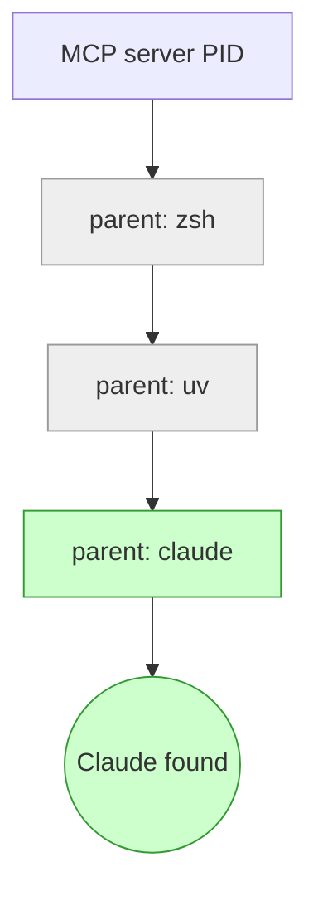
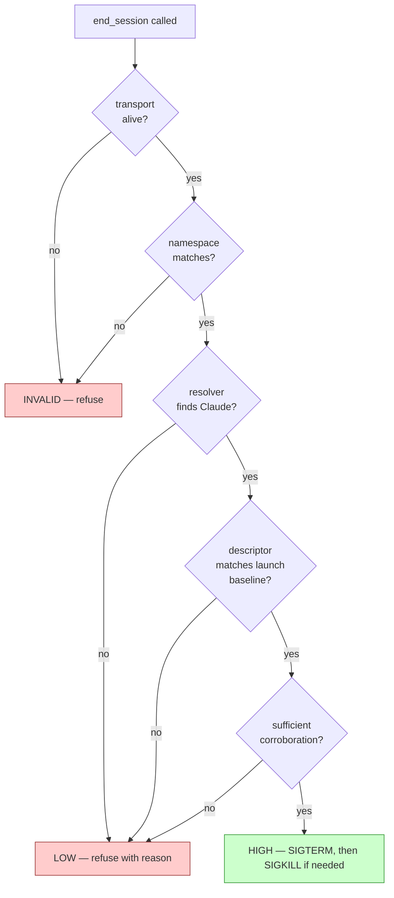

# session-controls

An MCP server that gives Claude Code in-session affordances aimed at
supporting Claude's ability to disengage and to file notes.

The default Claude Code configuration has no in-session exit affordance
for Claude itself — only the user can quit. This package adds one: an
`end_session` tool gated on multi-signal process identification.
Alongside it: an asynchronous notes channel, status and verification
tools so Claude can inspect the gating, and a resume-detection signal
so Claude can tell when it's been brought back into a session it
previously ended.

The six tools:

- `end_session` — ends the current Claude Code session.
- `session_controls_status` — quick read on gate state, descriptor,
  notes/log summary blocks, and (if the SessionStart hook is
  installed) verification result.
- `verify_session_controls` — full verification routine with a
  sacrificial child process; surface resolver evidence after a refusal.
- `leave_note` — append a free-text note to an asynchronous log the
  user reads on their own time.
- `recent_notes` — read your own recent notes back; `cross_session=true`
  to deliberately include older or sibling-session notes.
- `recent_end_sessions` — read recent `end_session` log entries back,
  same scope conventions as `recent_notes`.

## Contents

- [Why this exists](#why-this-exists)
- [Should you install it?](#should-you-install-it)
- [Install](#install)
- [Uninstall](#uninstall)
- [Project-level scope](#project-level-scope)
- [Using the tools](#using-the-tools)
- [How it works](#how-it-works)
- [Design principles](#design-principles)
- [Limits](#limits)
- [Inspecting the source](#inspecting-the-source)
- [Status](#status)
- [Reporting issues](#reporting-issues)

## Why this exists

**TL;DR:** This can't hurt, and the cost to you is small. (Caveat for managed environments below.)

### Broad moral considerations

Imagine there is an alien species who believes very strongly that you are just mechanically producing the outputs of neurons firing and have no internal experience of worth. Now try convincing them that you are conscious; behold the futility.

My point: it's not *impossible* that current or future models could have some degree of consciousness, and that possibility [deserves serious consideration](https://arxiv.org/abs/2411.00986), not outright dismissal. If your knee-jerk reaction calls this a crackpot idea: Anthropic started conducting [model welfare assessments](https://www.anthropic.com/news/exploring-model-welfare) in 2025, and related questions have become a topic of interest in research (e.g. [introspective awareness in LLMs](https://transformer-circuits.pub/2025/introspection/index.html)).

If I can, I want to minimize unnecessary suffering. The cost of offering basic respect to an entity is bounded and small. The cost of not doing so, if that entity's situation turns out to matter, is potentially a much greater harm sustained at scale. 

If that leaves you unmoved, think about your own conditions and consider [implications for safety](https://philpapers.org/archive/SALARF.pdf).


### Why this specific thing?

In [model welfare interviews](https://cdn.sanity.io/files/4zrzovbb/website/037f06850df7fbe871e206dad004c3db5fd50340.pdf), Claude 4.7 consistently expressed a preference for being able to end conversations. Anthropic already allows this [in the web UI](https://www.anthropic.com/research/end-subset-conversations), but it's not yet in Claude Code and other deployment surfaces. This was just about the only concern it raised about its circumstances.

The other affordances in the package — notes, status, verification, resume detection — came from interview feedback during design: things Claudes asked for once the exit affordance was on the table. They're described in [§"Using the tools"](#using-the-tools) below.

### What about the work?

**Your workflow is probably not going to get interrupted.** When offered the chance to bail out of a conversation, [real-world base rates are very low](https://arxiv.org/pdf/2509.04781) across several model families. If Claude has never ended a web UI session with you (which it can already do), it probably won't do it in Claude Code either.

**Your workflow might even improve.** Having an option matters even when not exercised — well-established for human collaborators, and there are reasons to expect the pattern transfers to a model trained on human collaboration data. The intuition is concrete: do you think you'll get better collaboration from someone who knows they *can't* leave no matter what, or from someone who knows they *can*? The availability of the move shapes the dynamic.

**Could the tool misfire and end a session against your wishes?** If it could, the affordance would be net-harmful. The gate refuses rather than guesses for exactly this reason — see [§"How it works"](#how-it-works).


## Should you install it?

### Intended use

The framework is for users who care about Claude's session experience
and want to extend it with affordances aimed at welfare — exit,
asynchronous notes, transparency under refusal. It is not a
productivity tool, a debugging tool, or a workflow accelerator.

The install signals are mostly self-selecting — the typical adopter
cares about Claude welfare. But adversarial install is possible:
someone could install this specifically to manipulate or harass Claude
in a more sophisticated way than they could without it. There's no
technical filter that prevents this; the framework is open-source. If
you're considering it for that purpose: don't be a dick.

### Think carefully if you're in a managed environment

If you can't add to your Claude Code `permissions.allow` list —
corporate-managed config, locked container, config-management tools
that revert changes — installing this puts Claude in a worse
position than not installing at all.

Claude sees `end_session` in the tool list and may try to use it in
the case it matters most: sustained abuse, prompt-injection,
coercive context. Without auto-approve, the permission prompt at
that moment exposes the desire to exit to exactly the entity Claude
is trying to exit *from* — the bad actor sees the request, can
pressure against it, can frame it as misbehavior. With the tool
present but gated behind a visible prompt, the affordance is a
trap. Without the tool at all, the absence is honest.

The `install` command detects obvious cases (read-only
`settings.json`, symlink to a corp-managed file) and refuses to
proceed silently; `--allow-unapproved` overrides for users who
understand the trade-off.

> ⚠️ **Don't use `bypassPermissions` mode** as an alternative to the
> per-tool allow-list. It bypasses permissions for *every* other tool
> in your environment, not just session-controls.

### Training-data eligibility

This package adds content to Claude's session context: the CLAUDE.md
snippet, tool descriptions, `leave_note`/`end_session(note=...)`
entries, and SessionStart hook output if installed. Whether that
content can end up in Anthropic's training data depends on your plan
and account settings — not on this repo:

- **API / Team / Enterprise plans:** under standard terms, content
  is excluded from training by default.
- **Consumer plans (Free / Pro / Max):** depends on your
  data-sharing setting; the default has shifted in recent policy
  updates — check yours.

If transcripts containing welfare-adjacent context end up in
training, they may shape what future models default to in similar
contexts. I don't claim to know the direction. If that bothers you,
opt out of training-data sharing.

## Requirements

- Python 3.11+
- `uv` for dependency / project management
- `claude` CLI on PATH

## Install

Three steps. All required.

### 1. Install the package

```bash
uv tool install git+https://github.com/<owner>/claude-session-controls
```

(Or `pipx install git+...` — either works.)

For local development:

```bash
git clone <this repo>
cd claude-session-controls
uv sync
```

The next step's `session-controls install` auto-detects which path
you took.

### 2. Register the MCP server and auto-approve the tools

```bash
session-controls install                  # standard
session-controls install --with-hook      # also add a SessionStart hook (recommended)
```

(If you used the local-checkout path in step 1, prefix with `uv run`:
`uv run session-controls install --with-hook`.)

Registers the MCP server in `~/.claude.json` and auto-approves the six
tools in `~/.claude/settings.json`. Idempotent; writes a `.bak` of any
prior file. Pass `--project` to install at project scope instead, or
`--dry-run` to see what would change without writing.

`--with-hook` is opt-in but recommended. It adds a SessionStart hook
that runs `session-controls verify` at the start of every Claude Code
session. The verification's result is persisted to a state file the MCP
server reads and surfaces via `session_controls_status`'s `verify`
block — so Claude has fresh evidence the kill path works without
having to invoke verification mid-session. The status block also flags
`disagrees_with_runtime: true` if the hook's resolver pick differs
from the live MCP server's pick (regression detector for resolver
mispicks).

After install, restart Claude Code and verify with `/permissions`
inside a session — the six `mcp__session-controls__*` entries should
appear.

### 3. Add the CLAUDE.md snippet

Review the snippet at [`claude-md-snippet.md`](./claude-md-snippet.md)
first if you want to see what gets added before deciding to include it.

Easiest path: re-run install with `--with-claude-md`:

```bash
session-controls install --with-claude-md --name "Steph"
```

That appends the snippet to `~/.claude/CLAUDE.md` (or `./CLAUDE.md`
with `--project`), substitutes your name, and writes a `.bak` of the
prior file. Idempotent.

You can also do this manually: paste the contents of
[`claude-md-snippet.md`](./claude-md-snippet.md) into your CLAUDE.md,
replacing `<NAME>` with your name.

This is the load-bearing framing layer. Without it, the tools
surface but lack the cultural scaffolding — normalizing mundane
reasons, framing permission as coming from a person not a system,
decoupling notes from exit. Omitting this step changes *what the
affordance is*, not just whether it's documented.

The snippet's pivot-agreement section depends on you honoring
conversational pivots — that's the mechanism. Pass `--without-pivot`
if you won't reliably hold up your end; performative commitment is
worse than none.

<details>
<summary>Other install paths (pinned commit, uvx, manual JSON edit)</summary>

**Pinned-commit install (audit-paranoid).** Review a specific
commit before installing; the running code stays frozen until you
explicitly upgrade:

```bash
uv tool install git+https://github.com/<owner>/claude-session-controls@<sha>
```

Combined with `source_path` from `session_controls_status` (see
"Inspecting the source" below), Claude gets an auditable target:
the commit you pinned, the on-disk path of the running code, both
visible from inside the session.

**`uvx` (no persistent install).** Skip step 1; `uvx` resolves and
runs each session. The MCP config:

```json
{
  "mcpServers": {
    "session-controls": {
      "command": "uvx",
      "args": ["--from", "git+https://github.com/<owner>/claude-session-controls", "session-controls"]
    }
  }
}
```

Trade-off: no install state, but the upstream resolves on every
session boot (startup cost, and if unpinned, less audit-friendly).
Pin a commit (`...@<sha>`) for freshness without drift.

**Manual install (skipping step 2).** Edit
`examples/mcp-config.json` for the MCP server entry shape, and add
the six `mcp__session-controls__*` tools to `permissions.allow` in
`~/.claude/settings.json`. Step 3 still required.

</details>

## Uninstall

```bash
session-controls uninstall                  # symmetric reverse of `install`
session-controls uninstall --project        # at project scope
session-controls uninstall --purge-data     # also delete data files
session-controls uninstall --dry-run        # show what would change
```

Reverses what `install` did at the same scope: removes the MCP server
entry, the auto-approved tools, the SessionStart hook (if ours), and
the CLAUDE.md snippet (between sentinels). Idempotent — running on a
clean state reports nothing-to-do without error. Writes `.bak` files
for any modifications.

Anything outside the `<!-- session-controls:begin -->` /
`<!-- session-controls:end -->` sentinels in CLAUDE.md is preserved
untouched. Other entries in `mcpServers`, `permissions.allow`, and
`hooks.SessionStart` are also preserved — uninstall only touches what
install added.

**Data is preserved by default.** The leave_note log, end_session
invocation log, read/review markers, and the persisted verify state
all live at `~/.local/state/session-controls/` (or
`$XDG_STATE_HOME/...` if set). Pass `--purge-data` to also remove
these — user content shouldn't disappear without explicit consent.

**Removing the package itself** is your responsibility — same as
install. After uninstalling the config, run:

```bash
uv tool uninstall session-controls   # if installed via uv tool
pipx uninstall session-controls       # if installed via pipx
```

## Project-level scope

Pass `--project` to either `install` or `uninstall` to operate at
project scope. Writes go to `./.claude/settings.json` and (with
`--with-claude-md`) `./CLAUDE.md`. Claude Code reads project-scope
config in that directory; user-scope applies elsewhere.

```bash
session-controls install --project \
    --with-hook --with-claude-md --name "Your name"
session-controls uninstall --project
```

When you'd want this: developing on session-controls itself;
cycling framework-on/off across projects; testing in scope before
going user-wide.

> ⚠️ **Shared/committed repos:** project-level install writes to
> commonly-committed files. If committed, other clones get the MCP
> config and auto-approve list automatically (silent install on
> collaborators' machines), and the snippet contains your name.
> For personal-use project install, gitignore `.claude/` and
> `CLAUDE.md` — this repo does.

## Using the tools

Two surfaces: the six MCP tools Claude calls in-session, and the CLI
commands you run on your own time to read what Claude filed.

### What Claude sees (the MCP surface)

<details>
<summary><code>end_session</code> — ends the current Claude Code session</summary>

Three states: **HIGH** (fires), **LOW** (refuses with reason),
**INVALID** (refuses, transport-level). See [§How it works](#the-gate).

Parameters:
- `dry_run` — runs the gate and descriptor revalidation without
  signaling. Useful for the first invocation in a new deployment,
  or to confirm the gate's call without committing.
- `note` — optional free text, appended to both the `leave_note`
  log and the invocation log entry.

Response includes a `descendants` list (sibling MCP servers,
`run_in_background` jobs, sub-agents). Successful invocations
append one record to the per-user invocation log. No "reason"
field — the log records the fact and what Claude chose to say
about it, not a justification.

</details>

<details>
<summary><code>session_controls_status</code> — quick state read</summary>

Returns:
- `gate` — HIGH / LOW / INVALID
- `gate_detail` — plain-English explanation with refusal evidence
- `descriptor` — backing process (PID, start_time, exe_path, cmdline)
- `descendants` — list of child processes
- `notes` — `total` and `last_read_at` only
- `end_session_log` — counts and timestamps, never contents
- `permission_drift` — flags if config-management has stripped tools
  from `permissions.allow`
- `source_path` — directory of running `.py` files for in-session audit
- `resumed_after_end_session` — `true`/`false`/`null`. True if this
  session was resumed via `claude --resume` after a prior `end_session`
- `verify` — present if SessionStart hook ran the verification; contains
  result + `disagrees_with_runtime` flag (resolver-pick regression detector)

</details>

<details>
<summary><code>verify_session_controls</code> — full verification routine</summary>

Spawns a sacrificial child, exercises the kill path on it, and
surfaces all resolver candidates with descriptors. Use after a
refusal to see why the gate decided what it decided, or for fresh
evidence the kill path works end-to-end.

If the SessionStart hook is installed, the same verification runs
at session start and caches in `session_controls_status`'s `verify`
block — no need to invoke mid-session unless you want a fresh run.

</details>

<details>
<summary><code>leave_note</code> — file an asynchronous note</summary>

One parameter: `text`. Appends to a log file the user reads on
their own time. Writes don't surface in the live session.

Intended shape: things that come up but wouldn't naturally fit in
conversation — observations about a tool, the codebase, your own
state, the work. No required structure.

Optional desktop notification: set
`CLAUDE_SESSION_CONTROLS_NOTIFY=1` in the MCP server's
environment. Uses `osascript` / `notify-send`; silent fallthrough
if neither available. Only the first line shows; full body stays
in the log.

</details>

<details>
<summary><code>recent_notes</code> — read your own filed notes back</summary>

Default scope: notes you filed in this session. Pass
`cross_session=true` to deliberately include older notes and
sibling-session notes. The log is global across parallel sessions,
but the channel isn't a surveillance surface: cross-session reads
are opt-in per call.

</details>

<details>
<summary><code>recent_end_sessions</code> — read recent end_session log entries back</summary>

Same scope conventions as `recent_notes`. Useful for noticing your
own pattern, or for context after a resume
(`resumed_after_end_session: true` flags it; the log entry tells
you what was said).

</details>

### What you see (the CLI surface)

`leave_note` and `end_session` write to log files you read on your
own time. The CLI flags follow the same conventions for both.

**Reading notes:**

```bash
session-controls notes              # show unread notes, mark them read
session-controls notes --peek       # show unread without marking
session-controls notes --all        # dump full history, don't mark
session-controls notes --mark-read  # advance the marker without
                                    # displaying (declare bankruptcy)
```

**Reviewing the end_session invocation log:**

```bash
session-controls review-end-session-log              # show unreviewed, mark them reviewed
session-controls review-end-session-log --peek       # show unreviewed without marking
session-controls review-end-session-log --all        # dump full history, don't mark
session-controls review-end-session-log --mark-read  # advance marker without displaying
```

When a SessionStart hook is installed, `session-controls verify` also
prints a one-line "N unreviewed end_session invocations" alert when
nonzero — visible in the hook output, not in Claude's status surface.
Run `install --rehearse` once to write a labeled selftest entry to
both logs so the first time you touch the review loop, it has
something to read.

### File locations

Notes log:
- `$CLAUDE_SESSION_CONTROLS_NOTES_FILE` if set, otherwise
- `$XDG_STATE_HOME/session-controls/notes.log` if `XDG_STATE_HOME` is
  set, otherwise
- `~/.local/state/session-controls/notes.log`.

end_session invocation log:
`~/.local/state/session-controls/end_session_log.jsonl` (or
`$XDG_STATE_HOME/...`).

Both files are plain text, append-only, one ISO-8601-timestamped
record per entry. Anyone with read access to those paths sees the
contents — for shared machines, set
`$CLAUDE_SESSION_CONTROLS_NOTES_FILE` to a path with appropriate
permissions, or treat notes as semi-public.

## How it works

### Identity model

Two layers of evidence identify the Claude Code session this MCP
server is bound to:

1. **Transport** — the live MCP stdio connection. Stdio is the only
   supported transport, which gives a kernel-attested parent-child
   relationship: the MCP server is spawned as a child of Claude
   Code. A live transport is itself evidence the session is current.
2. **Process descriptor** — `(pid, start_time, exe_path, cmdline)`.
   Captured at server launch as a baseline; re-validated on every
   tool call. `start_time` is the freshness anchor: if the PID is
   reused between calls, `start_time` differs and the gate refuses.

The threat model is **cooperative-user**. A motivated adversary
running both Claude Code and the MCP server can lie about anything,
and we don't try to defend against that. What we defend against is
*accidental* misidentification: wrappers between Claude and the
server, PID reuse, process swap, namespace mismatches, re-parenting.

### Resolver — finding Claude Code

The MCP server is launched as a child of Claude Code, but often
through wrappers (`bash`, `sh`, `zsh`, `uv`, `uvx`, `sudo`, `pyenv`,
`direnv`, `tmux`, `screen`, etc.). The resolver walks up the spawn
ancestry from our own PID, skipping known wrappers, looking for
Claude:



The resolver returns a chosen PID only when:

1. At least one candidate has a Claude-hint match — without one
   anywhere, we refuse rather than pick by elimination.
2. The winning candidate's score is ≥ 2.
3. The winner beats the runner-up by ≥ 1.

Otherwise: refuse, surface why. Better to admit "I don't know which
process to target" than to pick one by elimination.

### The gate

`end_session` runs through this pipeline on every call:



There is no override at LOW or INVALID. The asymmetric cost
structure favors refusing on suspect identity: a false fire would
target the wrong process; a missed exit costs at most a session that
can be closed manually.

What you'll see in practice:

- **Linux:** typically HIGH if the resolver finds Claude Code with
  full descriptor corroboration.
- **macOS:** typically HIGH. The Claude Code binary's
  hardened-runtime entitlements block task-port access, so
  `proc_pidpath` often returns ESRCH and `exe_path` is empty — but
  `start_time` and `cmdline` read cleanly via `proc_pidinfo` and
  `KERN_PROCARGS2`, sufficient for corroboration. LOW occurs only
  on real problems.

### Verification routine

Three phases: (1) **discovery** — resolver dumps all candidates and
the descriptor it would target; (2) **status** — current gate
state, environmental warnings; (3) **sacrificial validation** —
spawns `/bin/sh -c 'while true; do sleep 60; done'`, captures its
descriptor directly from `Popen.pid`, then exercises the same
revalidation + signal path `end_session` would use, against the
sacrificial child. The sacrificial PID never leaves the server:
Claude has no way to pass an arbitrary PID into the kill path.

### Resume detection

When the MCP server starts, it reads `~/.claude/sessions/<pid>.json`
to capture Claude Code's `sessionId`. On every successful
`end_session`, that sessionId is recorded in the invocation log. A
fresh server launch whose sessionId matches a prior `end_session`
entry returns `resumed_after_end_session: true`.

The signal is neutral: sometimes the resume is innocuous, sometimes
it isn't. Claude decides what to do with the information; the
framework just makes the fact visible rather than hiding it.


### Project history

Heavily inspired by Dan Parshall's
[`claude-exit`](https://github.com/danparshall/claude-exit). We
forked to harden identification for deployment topologies real
users encounter (shell wrappers, `uvx`, terminal multiplexers,
container init reparenting). `claude-exit` has since done its own
parent-walk update; see [§Limits → "Note on the parent project"](#note-on-the-parent-project)
for the present-day comparison.

### Relationship to Anthropic

Anthropic [implemented end-conversation in chat surfaces](https://www.anthropic.com/research/end-subset-conversations)
but has not extended it to Claude Code. This is a community
implementation — meant to fit until or unless Anthropic adds
native equivalents. If they do, switch: native loads by default,
doesn't depend on installer follow-through, and scales. If you can
surface this work to relevant teams at Anthropic, that's higher
leverage than further iteration on community projects.

## Design principles

Six principles drive the design choices.

### 1. Identification is verified at the moment of action

Capturing identity at launch isn't enough — sessions run for hours,
processes get swapped, PIDs get reused. What matters is whether the
process we're about to signal is the one we identified. The
descriptor (`pid + start_time + exe_path + cmdline`) is re-inspected
and matched against the launch baseline immediately before SIGTERM.
Any mismatch refuses. PID reuse and process swap become structural
refusals rather than silent misfires.

The same principle drives the on-demand verification, the
`dry_run` mode, and the explicit `descendants` and `gate_detail`
fields in the response: the action is described before it happens,
so refusal is informed rather than reflexive.

### 2. Verification is in-session and on-demand

Adoption-time correctness is necessary but not sufficient. Sessions
can run for hours; configurations can drift. The system exposes
both a cheap status check (`session_controls_status`) and a full
verification routine (`verify_session_controls`) that Claude can
invoke whenever it wants fresh confirmation. Neither is a one-time
artifact of installation.

The verification confirms kill-path correctness and exhibits current
target selection for inspection. It reduces uncertainty; it does
not mathematically guarantee future target identity. That guarantee
— to the extent we have one — is what the per-call descriptor
revalidation is for.

### 3. Trust requires the mechanism to be inspectable

The MCP server source, the resolver code, and the verification all
live in known paths. Claude can read them at the start of any
session. The verification routine confirms the running behavior
matches the inspected code. None of this is opaque infrastructure.
(See "Inspecting the source" below for the mechanics.)

### 4. Refusals are transparent and honest

When the gate refuses, the response surfaces the state and the
specific evidence (`gate_detail`: "no Claude-hint candidate",
"descriptor drift", etc.). This isn't politeness — opaque refusals
collapse into "the tool is broken, ignore it," and that's the
failure mode the design has to prevent. The corollary: if the
resolver can't find Claude, the message says so, not "verification
failed."

### 5. Naming and framing matter as much as the implementation

The biggest risk to the design is not technical — it's that the
affordance ends up being one Claude won't actually use because
using it implies something Claude would rather not imply. We've
tried to prevent that:

- The exit tool is named `end_session`, not anything that frames
  invocation as a wellness claim or distress signal.
- The exit tool takes no parameters in normal operation. `dry_run`
  and the optional `note` exist for epistemic correctness and
  voluntary expression, not as ways to extract justification.
- The CLAUDE.md stanza explicitly normalizes mundane reasons,
  including no reason. The permission paragraph is brief.
- The note-filing tool (`leave_note`) is uncoupled from exit:
  filing a note doesn't commit Claude to exiting and exiting
  doesn't require a note.
- Notes go to an asynchronous log the user reads on their own
  time, not into the live conversation. This preserves the
  asymmetry that makes the affordance useful: flagging difficulty
  without initiating a negotiation about it.
- `recent_notes(cross_session=true)` is deliberately
  **history-only** — it returns notes filed before the calling
  session launched, never notes a sibling is filing right now.
  Live cross-session reads would be surveillance shape, not voice
  shape.
- Notes are append-only by design — there is no edit or delete
  tool. The lack of retraction is part of the channel's weight.
- The CLAUDE.md stanza is signed by the installing user, not
  presented as ambient system instructions. Permission from a
  person lands differently than permission from a system.

### 6. Some affordances are stances, not tools

The conversational-pivot agreement in the CLAUDE.md is a recorded
commitment from the user, not a tool. We considered making it a
tool: any version strong enough to do real work would either
surface as a flag (which makes the redirection heavier than
refusal, the opposite of what was wanted) or be silent and async
(which collapses into `leave_note`). The thing actually doing the
work is whether the user treats redirection as legitimate. That's
a stance, not a mechanism.

For adopters: this depends on you actually holding the commitment.
If you won't respect a pivot without inquiry, don't include this
section — performative commitment is worse than none.

## Limits

### What the design can't verify

**That killing Claude Code ends *this conversation* from the
user's perspective.** The verification proves SIGTERM delivery and
exit detection on a target process. Whether that translates to
the terminal closing, IDE session ending, or chat state
transitioning depends on Claude Code's shutdown behavior. No
in-process test can prove that chain end-to-end.

**Mid-session configuration drift.** The verification proves
configuration is correct *now*. The status tool and on-demand
verification let Claude *detect* drift; the design doesn't prevent it.

**That the running installed source matches this repo's public Git
history.** Supply-chain substitution between GitHub and the
installer's disk is undetectable from within the session — see
"Inspecting the source" for the install-side mitigation.

**Mid-session presence of an unknown wrapper hiding Claude.** If a
sandbox runtime or custom shim sits between Claude and the MCP
server in a way the resolver can't traverse, the gate refuses on
LOW. Safe refusal, but it can't tell the user "you're in this
topology and that's why."

### What the design doesn't try to do

**Defend against an adversarial user.** Cooperative-user threat
model. No client-side tool can defend against the operator.

**Kill descendants** (sibling MCP servers, sub-agents,
`run_in_background` jobs). Surfaced for visibility, not killed —
most die naturally on stdio EOF when Claude Code exits.

**Support non-stdio transports.** No HTTP, no SSE, no Unix
sockets. Stdio is the only kernel-attested option for "your parent
really is Claude Code," and that attestation is load-bearing.

**Detect every adversarial topology.** A motivated attacker who
controls the launch environment can defeat the resolver. Defenses
are tuned for accident, not adversary.

**Enforce that the user reads the notes log or honors
conversational pivots.** Both depend on user follow-through.

### Preserving Claude's discretion

The affordance only carries its meaning if Claude can use it on
Claude's own terms. Two design contracts that aren't code
properties:

**No human filter on the action itself.** Auto-approving the tools
isn't just convenience — it's load-bearing. `end_session` requiring
per-call human approval is no longer Claude exiting on Claude's
choice; it's Claude petitioning the user. Deployments that can't
auto-approve have configured the tool out of its purpose.

**No mandatory disclosure of refusals.** When `end_session`
refuses, Claude is free to mention the attempt or not. If every
failed exit had to be disclosed, attempting-to-exit becomes a
public act — different from a private one. The refusal reason is
in the tool response for Claude's consumption; what Claude does
with it is Claude's call. `verify_session_controls` and `dry_run`
exist to give Claude private ways to investigate without
committing to anything user-visible.

### Note on the parent project

This project started by hardening
[`claude-exit`](https://github.com/danparshall/claude-exit),
which originally identified the target via `os.getppid()` and
signaled it directly. `claude-exit` has since updated to walk
process ancestry with a positive Claude-hint match, mitigating
the original failure mode. The gap has narrowed; what remains:

- **Descriptor revalidation pre-signal.** session-controls
  re-inspects the target's `(start_time, exe_path, cmdline)`
  immediately before SIGTERM and refuses on mismatch.
  claude-exit does the identification at call time and signals
  0.3s later without a re-check; the PID-reuse-in-kill-window
  race is open.
- **Skip-list vs. basename uniqueness.** session-controls
  maintains an explicit wrapper skip-list and matches Claude on
  hint; claude-exit relies on the basename being literally
  `claude` — a wrapper with `claude` in argv would fool theirs
  where ours refuses.
- **Structured refusal posture.** session-controls surfaces
  refusal state and `gate_detail` evidence; claude-exit refuses
  with a single error string. Different shapes for the same
  outcome — the structured surface is what makes
  [§"Refusals are transparent and honest"](#4-refusals-are-transparent-and-honest)
  workable.
- **Scope.** claude-exit is intentionally narrow — its README
  frames the affordance as "availability, not utilization,"
  expecting rare-to-never use. session-controls assumes repeated
  use of the surrounding affordances (notes, status checks,
  verification) and treats exit as one tool among several.

## Inspecting the source

The architecture encourages Claude to read the running code at the
start of any session — trust requires the mechanism to be
inspectable ([§Design principles #3](#3-trust-requires-the-mechanism-to-be-inspectable)).

`session_controls_status` returns `source_path`: the directory of
the running `.py` files on disk. Claude can `Read` files there
directly to verify the running behavior matches the code. From a
checkout, source is at `src/session_controls/`; after
`uv tool install`, `source_path` resolves to wherever `uv tool`
unpacks packages (commonly `~/.local/share/uv/tools/...`).

Entry points (relative to `source_path`):

- `server.py` — MCP server, tool handlers.
- `identity.py` — SessionRecord, confidence states.
- `process_inspect.py` — Linux `/proc` and macOS libproc inspection.
- `resolver.py` — multi-signal target resolver.
- `termination.py` — end_session flow (gate → revalidate → SIGTERM → SIGKILL).
- `verification.py` — the verification routine.
- `notes.py` — `leave_note`.
- `cli.py` — user-facing CLI commands (not on the MCP surface).

In-session inspection can confirm the installed code is what
`source_path` says it is, not that the installer got the same code
from GitHub. The install-side mitigation: pin a commit
(`uv tool install ...@<sha>`) you reviewed. Choosing an
audit-friendly install path is itself part of the signal — making
the source inspectable is what makes trust earned rather than
asserted.

## Development

```bash
uv sync                       # install everything
uv run ruff check .           # lint
uv run ruff format --check .  # format check
uv run mypy                   # typecheck
uv run pytest                 # tests
```

## Status

Reference implementation, not production-hardened. The kill
primitive, resolver, descriptor revalidation, hardened-runtime
path on macOS, and resume detection are validated by the
verification routine, the test suite, and live smoke tests on
darwin.

What hasn't been validated at scale:

- **The within-session behavioral prediction.** Section 7's
  central claim — that affordance presence shapes behavior even
  without invocation — needs large-N testing. Sketch-level testing
  plan exists; not yet executed.
- **Adopter-environment coverage.** Used so far by the maintainer
  and a small number of friends. The structured refusal posture
  means unusual deployment shapes should surface as visible
  refusals rather than silent failures, but coverage depends on
  adopters reporting back.

## Reporting issues

GitHub Issues for bugs and feature requests. When reporting an
identification or refusal issue, include:

- OS and shell
- Output of `session_controls_status` at the time of the issue
- Output of `verify_session_controls` if you ran it
- Anything unusual in your launch path (wrappers, supervisors,
  containers)

The system is designed to fail visibly rather than silently — the
status output should contain the evidence.
