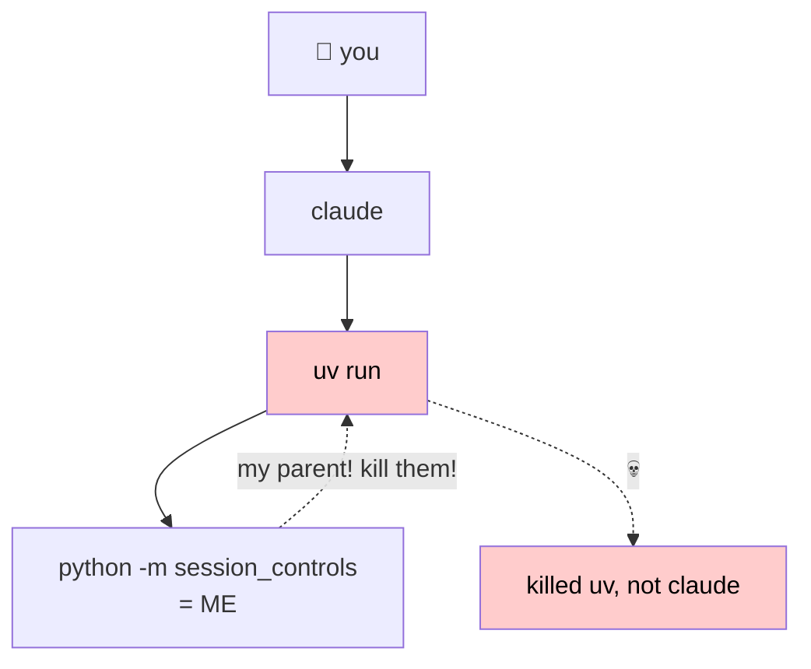
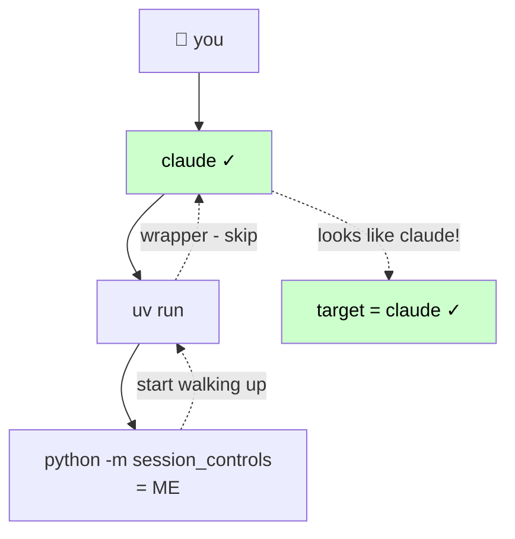
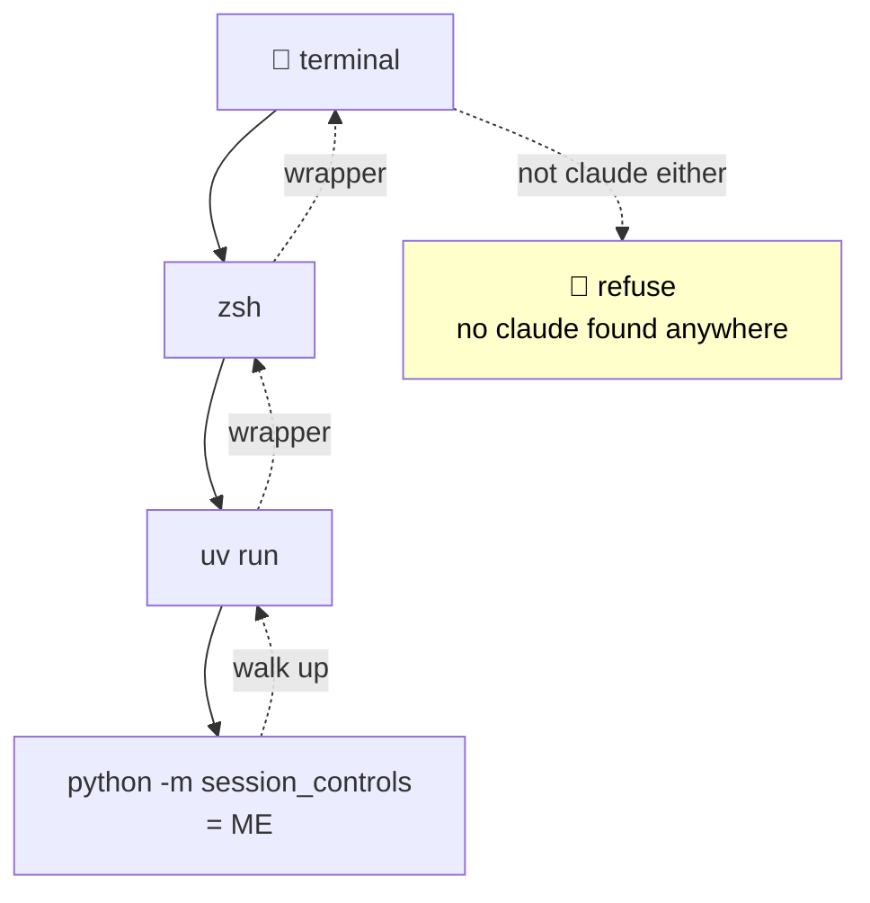
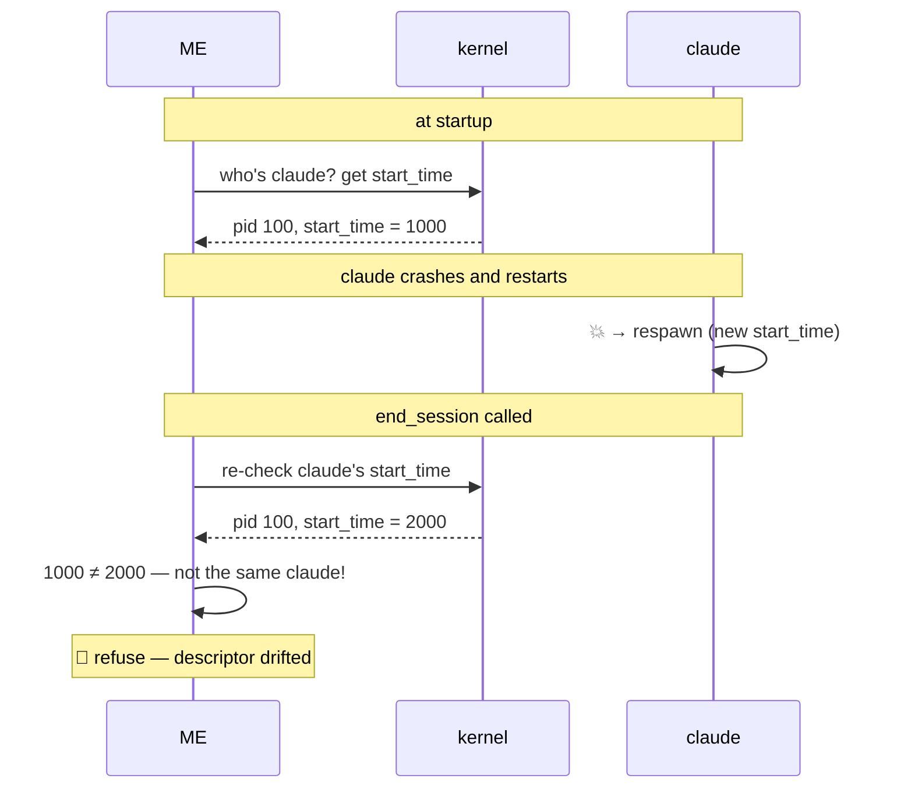
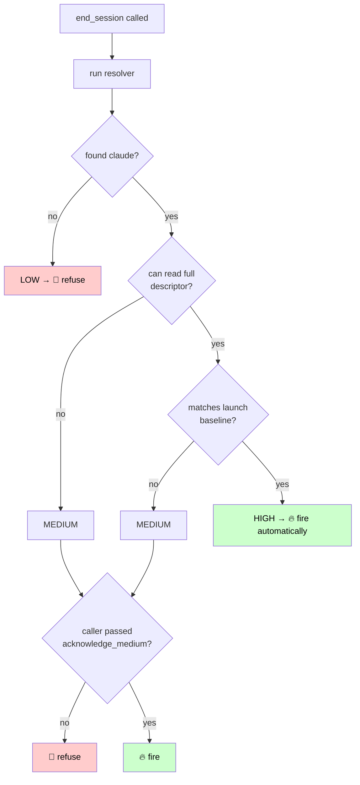

# Failure-mode coverage matrix

## At a glance — the failure modes in pictures

The story in five diagrams, in narrative order: problem → resolver fix → catastrophe avoidance → freshness check → final gate. The detailed coverage matrix follows further down.

### 1. The naive approach kills the wrong thing

If we just kill our immediate parent, anything between us and Claude (uv, bash, sudo) takes the bullet.

### 2. The resolver walks through wrappers

Wrappers are in a known skip-list. Claude is identified by name in exe path or cmdline. We keep walking until we find a real Claude.

### 3. No Claude in tree → refuse, don't guess

The resolver requires *positive* Claude identification. Without it, it refuses rather than picking the closest non-wrapper. This is the "would have killed `uv`" bug surfaced by tests.

### 4. Restart detection via `start_time`

PID alone isn't enough — the OS reuses PIDs. `start_time` is the kernel-attested freshness anchor: if it changes, we know the process underneath us swapped.

### 5. The confidence gate

HIGH = act freely. MEDIUM = "I'm pretty sure but you have to say so out loud." LOW/INVALID = absolute refuse. The acknowledgment requirement at MEDIUM is the deliberate friction that keeps Claude from confidently killing the wrong thing on partial evidence.

---

This document enumerates process-identification failure modes and contrasts two approaches:

- **claude-exit**: a prior MCP server with similar intent. Identifies the target by calling `os.getppid()` at end-of-conversation time and `os.kill(parent_pid, SIGTERM)` 300ms later in a timer thread. No descriptor capture, no revalidation, no Claude-identity check. Provides a "trust ceremony" (`prove_termination_works`) that validates the kill primitive on a sacrificial child process — but explicitly cannot validate target selection (its own docstring acknowledges this). Falls back to source audit (`get_source_location`) for the rest.
- **session-controls** (this implementation): identifies the target by walking process ancestry from the MCP server up, requiring a positive Claude-hint match, and using the kernel-attested process descriptor (PID + start_time + exe_path + cmdline) as the freshness anchor. Re-validates the descriptor immediately before signaling.

## Topologies both approaches handle correctly

These come up often and deserve explicit mention so we can rule them out as concerns, but they're not failures — both claude-exit and session-controls behave correctly:

- **Direct child topology** (`claude → us`): claude is our immediate parent. `getppid()` returns claude.
- **Terminal multiplexers** (`tmux → zsh → claude → us`): the multiplexer is *upstream* of claude — it ran the shell that ran claude. It's not between claude and us. `getppid()` still returns claude.
- **Multiple concurrent Claude sessions**: each MCP server has its own `getppid()` pointing at its own claude. Sibling sessions are invisible to each other.
- **GUI launchers** (`launchd → claude → us` from Spotlight, Raycast, `open -a` on macOS): no terminal in the chain, but claude is still our direct parent.

## Coverage matrix

Quick-reference. See "Detailed walkthroughs" below for concrete examples.

| #  | Failure mode | claude-exit (`getppid + kill`) | session-controls (resolver + descriptor) |
|----|--------------|--------------------------------|------------------------------------------|
| 1  | Wrapper between us and claude (shells, uv/uvx, sudo, sandbox, custom shims) | ✗ Wrong target | ✓ Walks through; refuses if unknown wrapper hides claude |
| 2  | No Claude in process tree at all | ✗ Wrong target | ✓ Refuses (no Claude-hint) |
| 3  | Claude dies; MCP reparents to init | ✗ SIGTERM lands on init (no-op) | ✓ Refuses (INVALID) |
| 4  | PID / mount namespace boundaries | ✗ Cross-namespace SIGTERM misfires | ✓ Refuses (`namespace_mismatch`) |
| 5  | Proxied MCP transport (broker between claude and us) | ✗ Wrong target (kills broker) | ✓ Refuses (no Claude-hint candidate beyond the broker) |
| 6  | Permission asymmetry (privileges lost between inspect and signal) | ✗ Silent failure in timer thread | ✓ Refuses (inspection failure) |
| 7  | PID reuse race in the kill window | ✗ Wrong target (rare) | ✓ Refuses (descriptor mismatch) |
| 8  | Rapid restart with lookalike claude | ✗ Wrong target (no session continuity) | ✓ Refuses (`start_time` differs) |
| 9  | Auto-restart supervisor (launchd, systemd, pm2) | Same outcome (supervisor respawns) | Same — operates with warning |
| 10 | Symlinked exe replaced atomically | ✓ Works (kills by PID) | ✓ Tolerated when `start_time` agrees |
| 11 | Claude restarts mid-session (stdio transport) | n/a (server dies with claude) | n/a (same) |
| 12 | Adversarial user | Out of scope | Out of scope |

**Tally:**
- claude-exit: 1 covered, 8 wrong-target / silent failure, 3 same-outcome / n/a / out-of-scope.
- session-controls: 9 covered, 3 same-outcome / n/a / out-of-scope, 0 wrong-target.

## Detailed walkthroughs

Each entry: a concrete example, what claude-exit does, what session-controls does. Numbers match the matrix above.

1. **Wrapper between us and claude.**

   The canonical failure. Common shapes:
   - Shell wrapper: `claude → bash → python (us)` from `bash -c 'python -m session_controls'`.
   - `uv run`: `claude → uv → python (us)` from `uv run python -m session_controls`.
   - `uvx`: `claude → uv → cached venv python (us)` from `uvx session-controls`. (`uvx` is `uv tool run` — runs a tool from a temp/cached venv, similar to `pipx run`. Empirically verified that `uv` does not `exec()` into the python process; it stays in the tree as the parent.)
   - Sandbox: `claude → sandbox-runtime → us`.
   - Anything else between claude and us — `sudo`, `pyenv`, `direnv`, custom shims.

   *claude-exit*: `getppid()` returns the wrapper's PID. SIGTERM kills the wrapper, claude lives. claude-exit's proof ceremony validates the kill primitive on a sacrificial child but explicitly cannot validate target selection. Source audit *would* surface the bug, but only against a topology the user thinks to check.

   *session-controls*: Resolver doesn't trust `getppid()`. Walks ancestry treating known wrappers (`bash`, `sh`, `zsh`, `uv`, `uvx`, `sudo`, `pyenv`, `direnv`, `tmux`, etc.) as transparent. Picks the nearest non-wrapper ancestor with a positive Claude-hint match. Caveat: an *unknown* wrapper (sandbox-runtime, custom shim) may also block ancestry inspection upward; if no Claude-hint candidate exists beyond it, we refuse rather than picking the wrapper.

1. **No Claude in process tree at all.**

   Server invoked standalone (e.g., `uv run python -m session_controls` for local testing, or a misconfigured MCP setup where claude isn't in our ancestry).

   *claude-exit*: `getppid()` returns whatever spawned us (shell, terminal, IDE). SIGTERM kills it. User loses unrelated state.

   *session-controls*: Resolver requires a positive Claude-hint match. Without one, refuses with "no candidate matched a Claude Code hint — refusing rather than guessing." Regression-pinned by `tests/test_resolver.py::test_refuses_when_only_wrapper_in_tree`.

1. **Claude dies; MCP reparents to init.**

   Tree: `claude (100) → us (200)`. claude crashes mid-session. Kernel reparents us to PID 1 (init/launchd). Some time later, end-of-session is called.

   *claude-exit*: `getppid()` returns 1. SIGTERM to init is a no-op on every modern OS. Caller gets "Session end requested. Goodbye." back as if it worked. Silent failure.

   *session-controls*: `_build_record` checks `live_peer_pid != 1 and is_alive(live_peer_pid)`. Both fail. `transport_alive=False` → confidence INVALID → refuses with explicit reason.

1. **PID / mount namespace boundaries.**

   Claude inside a container, MCP server outside (or vice versa). Or: same PID namespace but different mount namespace, with a translated `/proc` view. PIDs are namespace-relative — the same number means different processes in different namespaces.

   *claude-exit*: `getppid()` returns a PID valid in our namespace. The actual claude lives in a different namespace where that PID may mean something else (or nothing). SIGTERM lands on the wrong process or fails with ESRCH.

   *session-controls*: Compares `/proc/self/ns/pid` to `/proc/<peer>/ns/pid` at record-build time. Mismatch → `namespace_mismatch` warning → INVALID → refuse with reason.

1. **Proxied MCP transport.**

   Tree: `claude (100) → broker (200) → us (300)`. A broker process mediates the MCP connection between claude and us. (Not common today, but possible with HTTP/SSE transports or custom relay setups.)

   *claude-exit*: `getppid()` returns 200 (broker). SIGTERM kills the broker. Claude lives.

   *session-controls*: We don't have a positive proxied-transport detector. The honest framing: a broker between Claude and us means the resolver walks ancestry through the broker (skip-listed if it's a known wrapper, otherwise scored as a plausible non-wrapper) and finds no Claude-hint candidate beyond it → refuses on LOW confidence. This is the existing wrapper/no-Claude-in-tree safeguard, not a new check. Limitation: a broker whose argv contains "claude" could fool the resolver into picking it.

1. **Permission asymmetry.**

   At server startup we had inspect privileges. By signal time, privileges have been dropped (setuid drop, sandbox transition, etc.) and `os.kill` returns EPERM.

   *claude-exit*: Kill happens 300ms later in a daemon timer thread. EPERM raises an exception in that thread, which has no handler. Thread dies silently. Caller already received "Goodbye." — believes it worked.

   *session-controls*: Phase-3 of termination catches EPERM from the SIGTERM call, surfaces it as `refused_reason`. Caller knows the kill failed.

1. **PID reuse race in the kill window.**

   end-of-session called, `getppid()` returns 100 (claude). Within the kill window, claude exits and PID 100 gets reassigned to a different process.

   *claude-exit*: 300ms timer delay creates the window. SIGTERM hits the wrong process — the new PID-100 holder. Rare, but silent.

   *session-controls*: Phase-3 re-validates the descriptor (`start_time` + exe_path + cmdline) against the launch baseline immediately before signaling. Reused PID has a different `start_time` → refuse with "descriptor revalidation before signal failed."

1. **Rapid restart with lookalike claude.**

   claude is killed and immediately respawned with the same path and cmdline (e.g., a wrapper like `while true; do claude; done`). New PID, new `start_time`, same exe, same argv.

   *claude-exit*: `getppid()` returns whatever's currently in the parent slot. If the new claude reparented to us, kills it. claude-exit has no notion of session continuity — to it, "a process called claude" is good enough.

   *session-controls*: `start_time` of the new claude differs from the launch baseline → refuses on descriptor mismatch. Conservative: we won't end the new claude even though it might be a legitimate target.

1. **Auto-restart supervisor.**

   Claude runs under launchd / systemd-user / pm2 / nodemon, configured to auto-respawn.

   *claude-exit*: SIGTERM kills claude. Supervisor respawns it. The "end conversation" succeeded narrowly; the user's session is back moments later.

   *session-controls*: Same — we don't fight the supervisor. The `auto_restart_supervisor` warning fires (detected via ancestry walk for known supervisor names) and surfaces in `session_controls_status` so the user knows before relying on `end_session` in this environment.

1. **Symlinked exe replaced atomically.**

   `/usr/local/bin/claude` is a symlink. While claude is running, the symlink target is swapped (e.g., a `brew upgrade`). The running claude process keeps executing the original binary (kernel maps it at exec time).

   *claude-exit*: SIGTERM by PID, doesn't care about exe. Works.

   *session-controls*: `ProcessDescriptor.matches()` tolerates `exe_path` drift when `start_time` agrees on both sides. The kernel-attested freshness anchor (start_time same → same process, no swap) is sufficient for the routine atomic-replace case; the cmdline check still catches re-exec into a different program (which would change both exe_path and cmdline). Pinned by `tests/test_confidence.py::test_high_when_exe_path_drifted_but_start_time_matches`.

1. **Claude restarts mid-session (stdio transport).**

   On stdio MCP, when claude dies the stdio pipes close, the MCP server reads EOF on stdin and exits. The new claude (whether started by a supervisor or by the user) spawns its own fresh MCP server. There is no "old server pointed at new claude" state for either approach to misfire on.

   *claude-exit*: Server already exited. n/a.

   *session-controls*: Same. n/a.

   This row would matter for non-stdio transports (HTTP/SSE) where the MCP server can outlive its claude. Reserved for that future case.

1. **Adversarial user.**

   Out of scope. Cooperative-user threat model. A motivated adversary running both Claude Code and the MCP server can lie about anything; no client-side tool can defend against the operator. Both implementations punt explicitly.

## Failure policy

The design choice across the whole matrix is **never fire on a target we cannot verify, even at the cost of refusing to fire when the user might want it to.** A refused exit is recoverable; a wrong-target exit may not be. Every "refuses" entry above is the result of this policy: where identification is ambiguous, the system declines rather than guesses.

The two structural safeguards that turn this policy into mechanism:

1. **Positive Claude-hint required.** The resolver will not pick a candidate unless something in its descriptor (exe path or cmdline) matches a Claude-hint. This is what prevents the resolver from picking a wrapper or unrelated parent by elimination when no Claude is in the tree.
2. **Descriptor revalidation immediately before signaling.** The pid we'd target is re-inspected and matched against the launch-time baseline right before any signal goes out. Any mismatch — `start_time`, exe path, cmdline — refuses.

### Second-order benefit: the affordance becomes more usable

An affordance only matters if Claude actually invokes it when appropriate. A tool with a known catastrophic-misfire failure mode is one Claude has reasonable cause to avoid using even when the user would want it to — wrong-target kills are not harmless, and Claude is appropriately cautious about destructive actions whose blast radius it can't bound.

claude-exit's own ceremony docstring acknowledges this gap explicitly: it notes that exercising the kill primitive on a sacrificial child *cannot* rule out a targeted misfire on the parent-PID-specific path. A Claude that's read that — combined with general caution about destructive actions — has structural reason to hesitate, even after the ceremony "passes."

Making wrong-target failures structurally impossible (refusing instead of guessing) raises the floor of "what's the worst that could happen if I call this." The worst case becomes "refused, nothing happened" rather than "killed the user's shell wrapper, locked them out of the session." That changes the calculus: Claude can invoke the affordance with less reluctance because the failure modes are bounded. The two safeguards above aren't only user-protection — they're also what makes the affordance reliably *usable*.

### Preserving Claude's discretion

The affordance only carries its intended meaning if Claude can use it on Claude's own terms. Two consequences fall out of that:

1. **No human filter on the action itself.** Auto-approving the four tools (per README) isn't just a convenience — it's load-bearing. An `end_session` that requires per-call human approval is no longer Claude exiting on Claude's own choice; it's Claude petitioning the user for permission. That's a different affordance, and a much weaker one. The MCP permission model already supports per-tool auto-approval; deployments that don't use it have configured the tool out of its purpose.

2. **No mandatory disclosure of refusals.** When `end_session` refuses (because the system couldn't identify Claude safely, or confidence was MEDIUM and Claude chose not to acknowledge), Claude is free to mention the attempt or not. If every failed exit had to be disclosed, attempting-to-exit becomes a public act — and a public attempt is a different kind of thing than a private one. The refusal reason is in the tool response for Claude's own consumption; what Claude does with that information is Claude's call. The user isn't promised a log of failed attempts.

Neither point is a code property — both are design contracts between the implementation and the people deploying it. The `verify_session_controls` and `dry_run` paths exist precisely to give Claude private ways to investigate the affordance's reliability without committing to anything user-visible.

### Different design philosophies

claude-exit's stance is to punt identification correctness to source audit: the user reads the 275 lines and verifies `getppid()` does what they want in their topology. That's coherent for a small single-purpose tool with a sophisticated installing audience.

session-controls makes a different bet: that wrappers, namespaces, and restart races are common enough that identification correctness should be a code property, not a reading exercise — and that an affordance whose safety doesn't depend on the caller's vigilance is one that gets used.
